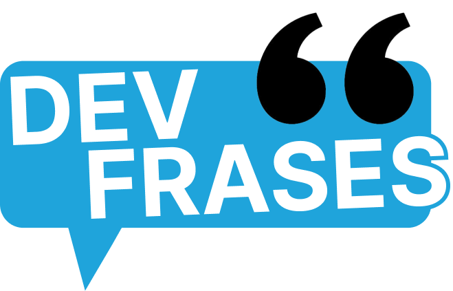

# Dev Frases

#

## O que é dev frases?
Dev frases é um sistema simples de geração aleatoria de frases baseados em alguma categoria, por exemplo: mensagens de bom dia, insentivo, parabéns etc. 

o intuito de criação desse projeto é de somente estudos relacionados ao frontend, afim de entender e praticar as principais ferramentas do React.

entre algumas coisas que foram implementadas nesse projeto está:
* interação de listas com o *.map*
* criação e alteração de estado de objetos com o *useStatus*
* renderização condicional

#

## Tecnologias
- *React*
- *Typescript*
- *Vite*
